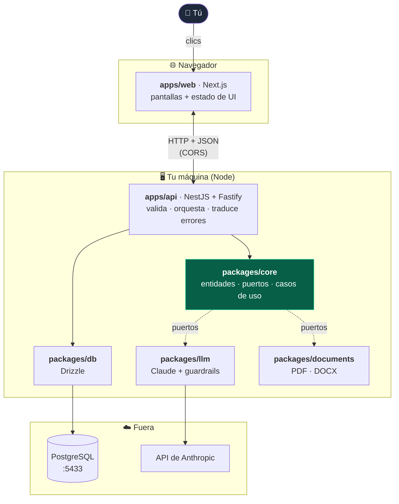
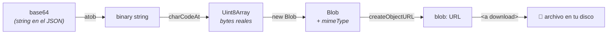
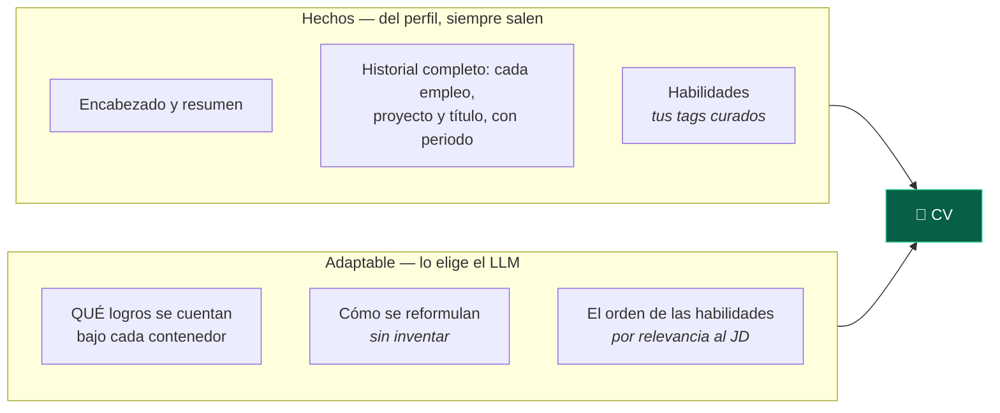
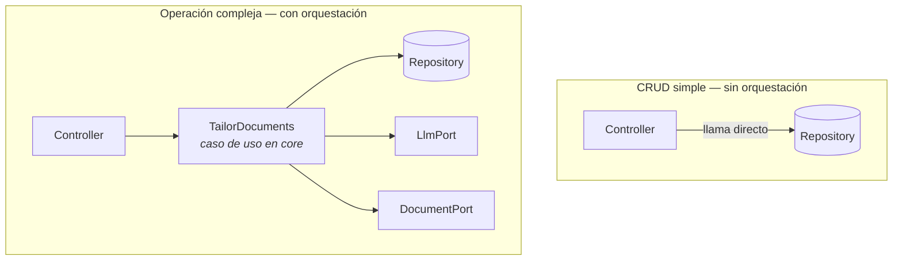
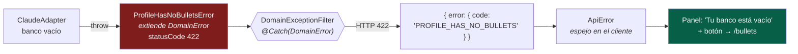
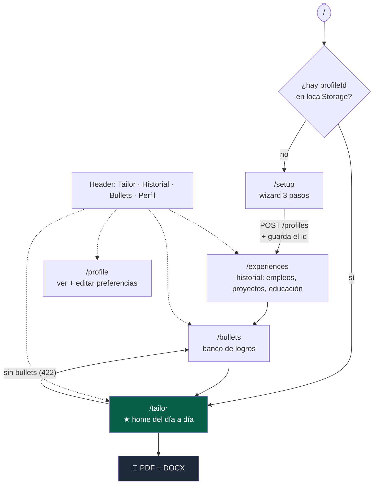
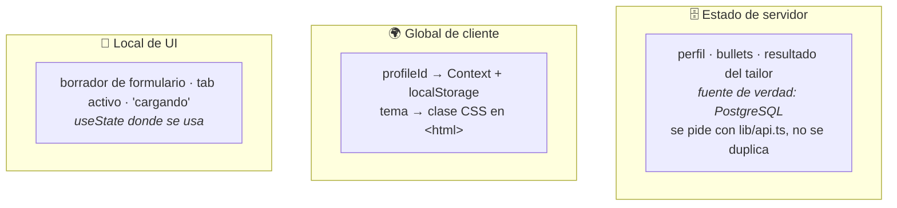
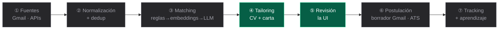

# JobFinder — Cómo funciona, de punta a punta

Guía visual del recorrido completo: desde que haces clic en el navegador hasta que
se descarga un PDF. Complementa a [ARQUITECTURA.md](./ARQUITECTURA.md) (el diseño)
con el **flujo real** de la Fase 1.

---

## 1. El mapa: quién habla con quién



**La clave:** `core` está en el centro y **no conoce a nadie**. Los demás dependen
de él, nunca al revés. Las flechas punteadas son *puertos*: `core` define el
contrato (`LlmPort`, `DocumentPort`) y los packages lo implementan.

---

## 2. El flujo estrella: generar un CV adaptado

Lo que ocurre al pulsar **"Generar CV y carta"**:

```mermaid
sequenceDiagram
    autonumber
    participant U as 👤 Tú
    participant W as apps/web
    participant P as ZodValidationPipe
    participant C as TailorController
    participant UC as TailorDocuments<br/>(core)
    participant DB as Repositorios<br/>(perfil · empleos · bullets)
    participant L as ClaudeAdapter
    participant D as DocumentAdapter
    participant F as DomainExceptionFilter

    U->>W: pega la oferta y pulsa Generar
    W->>C: POST /profiles/:id/tailor
    Note over W,C: lib/api.ts — el único sitio que habla HTTP

    C->>P: el body pasa primero por el pipe
    alt datos inválidos
        P-->>F: ValidationError (400)
        F-->>W: { error: { code, message, field } }
        W-->>U: marca el input exacto en rojo
    end

    P->>C: dto ya validado y tipado
    C->>C: buildJob() — arma un Job "manual"
    C->>UC: execute({ profileId, job, lang, formats })

    UC->>DB: findById(profileId)
    alt no existe
        DB-->>F: NotFoundError (404)
    end
    DB-->>UC: Profile

    par en paralelo (ahorra ~la mitad del tiempo)
        UC->>L: tailorCv(job, profile, lang)
        L-->>UC: TailoredCv
    and
        UC->>L: tailorCoverLetter(job, profile, lang)
        L-->>UC: texto de la carta
    and
        UC->>DB: findByProfileId — empleos y banco de bullets
        DB-->>UC: Experience[] · Bullet[]
    end
    Note over L: selecciona bullets REALES del banco.<br/>Si inventa alguno, se descarta solo ese<br/>(ADR-0025); cada bullet arrastra su ORIGEN

    UC->>UC: COMPONE el CV: + formación (siempre)<br/>+ habilidades desde los tags curados
    Note over UC: reglas de negocio del CV, no del LLM<br/>(ADR-0026 · ADR-0027)

    loop por cada formato (pdf, docx)
        UC->>D: generateCv(cv, profile, experiences, ...)
        D-->>UC: DocumentArtifact { bytes, mimeType, kind, filename }
    end
    Note over D: agrupa en bloques: empleos por empresa<br/>(TODOS, para no abrir huecos), proyectos<br/>y formación por su contexto

    UC-->>C: { cv, coverLetter, files }
    C->>C: bytes → base64 (JSON no transporta binario)
    C-->>W: 200 + JSON
    W-->>U: preview en tabs + botones de descarga
```

### Y al pulsar "descargar": el camino inverso



Es el **espejo exacto** de lo que hizo la API: `Buffer.from(bytes).toString('base64')`.

### De dónde sale cada parte del CV

No todo el documento lo decide el LLM. Separar qué es **adaptable** y qué es un
**hecho** es lo que evita huecos en el historial y secciones que desaparecen:



Ningún contenedor (empleo, proyecto o título) queda mudo aunque el LLM no
eligiera ningún logro suyo para esa vacante: `TailorDocuments` rellena el hueco
con el mejor bullet real del banco por solapamiento de skills, nunca inventado
(cobertura garantizada, ADR-0028, que generaliza la regla que ADR-0026 aplicaba
solo a la formación). Y las habilidades salen de tus etiquetas, no de keywords
que el modelo extrae de la oferta (ADR-0027).

---

## 3. Las dos formas de usar los packages

No todos los endpoints tienen la misma forma, y la diferencia importa:



| | Cuándo | Ejemplo |
|---|---|---|
| **Sin caso de uso** | validar → repo → responder | `POST /profiles`, CRUD de bullets |
| **Con caso de uso** | coordinar varios puertos + reglas de negocio | `POST /tailor` |

Un "service" que solo reenvía al repositorio es una capa vacía. Por eso el CRUD
llama al repositorio directamente, y solo el tailoring tiene caso de uso — que
además vive en `core`, para que mañana el `worker` pueda reutilizarlo.

---

## 4. El viaje de un error (lo que hace la app predecible)

Un error nace en el dominio y llega al usuario como una **acción**, no como un 500:



El mismo mecanismo cubre: `400` validación (marca el campo), `404` no encontrado,
`409` email duplicado, `429` rate limit, `504` timeout. **Un solo filtro** para
todos, porque cada error ya trae su `statusCode` y su `code` desde `core`.

---

## 5. Las pantallas y sus guardas



`/setup` no está en el menú: solo se llega si no hay perfil. Las guardas viven en
cada pantalla y dependen del `profileId` (Context + localStorage).

---

## 6. Dónde vive cada tipo de estado (frontend)



Sin Redux: la app tiene exactamente **dos** datos globales de cliente. El tema ni
siquiera pasa por React — cambia una clase y la cascada CSS repinta todo.

---

## 7. Qué está construido y qué no



En la Fase 1 las etapas ① a ③ se sustituyen por **pegar la oferta a mano**: es el
flujo real de esta fase, no un atajo de pruebas. La Fase 2 construye la ingesta
para que las vacantes lleguen solas.
